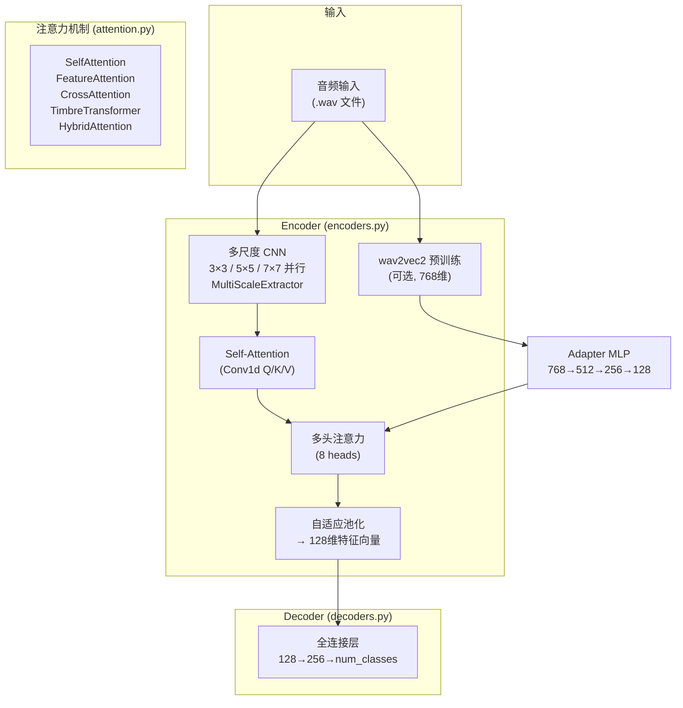

# InstrumentTimbre 模型架构分析

> 项目：基于 ARES 的音色识别/转换模型
> 索引耗时：0.94s | 142 个 .py 文件 | 日期：2026-07-06

---

## 一、索引日志

```
开始时间: 2026年 7月 6日 星期一 20时59分53秒

worker: project=0 starting index_project dir=/Users/scc/code/AIproject/music_ai/InstrumentTimbre lang=
BATCH [0..99] of 142 (100 files)
BATCH [0..99] done, total indexed: 100
BATCH [100..141] of 142 (42 files)
BATCH [100..141] done, total indexed: 142
POST_BUILD: symbol graph...
buildGraph: 142 files | file_list=3ms delete=1ms rf=0ms r2n=54ms
  nodes=46ms edges=92ms calls=0ms total=199ms
{"ok":true,"files_indexed":142,"workers":14,
  "time_parse_ms":21,"time_sqlite_ms":234,
  "time_buildgraph_ms":199,"time_fts_ms":92,"time_vector_ms":0,
  "discovery":{"seen_dirs":296747,"seen_files":293437,
    "skipped_dirs":3270,"skipped_files":0,
    "skipped_suffix":293213,"candidate_files":142}}

结束时间: 2026年 7月 6日 星期一 20时59分54秒
总耗时: 0.94s
```

### 关于 ./data 目录

`.gitignore` 中已有 `data/` 规则，FilterPolicy 读取后自动跳过。从发现统计可见：
- **293,437 个文件被扫描**（其中 293,213 个因后缀被过滤 — 绝大多数是 data/ 下的音频数据）
- **142 个候选文件**（仅 .py 源码）
- index 阶段干净，无噪音

---

## 二、模型架构总览



---

## 三、核心组件

### 3.1 Encoder (`models/encoders.py`)

**InstrumentTimbreEncoder** — 主编码器，将音频转为 128 维音色特征向量。

#### 双路径结构

| 路径 | 输入 | 处理 | 输出维度 |
|------|------|------|---------|
| **wav2vec2**（可选） | 原始音频 | `torchaudio Wav2Vec2Base → Adapter MLP(768→512→256→128)` | 128 |
| **多尺度 CNN**（默认） | 频谱图 | `Conv2d 3×3 / 5×5 / 7×7 并行 → 拼接 → Self-Attention → 8头注意力 → 池化` | 128 |

```python
class InstrumentTimbreEncoder(nn.Module):
    def __init__(self, input_channels=1, output_dim=128, use_pretrained=False):
        self.multi_scale_extractor = nn.ModuleDict({
            'scale_3': nn.Conv2d(input_channels, 64, 3, padding=1),   # 3×3 卷积
            'scale_5': nn.Conv2d(input_channels, 64, 5, padding=2),   # 5×5 卷积
            'scale_7': nn.Conv2d(input_channels, 64, 7, padding=3),   # 7×7 卷积
        })
        # 后续：残差连接 → Self-Attention → 多头注意力 → 自适应池化 → 128维
```

### 3.2 Decoder (`models/decoders.py`)

| 解码器 | 结构 | 用途 |
|--------|------|------|
| InstrumentTimbreDecoder | `Linear(128, 256) → ReLU → Dropout → Linear(256, num_classes)` | 基础分类 |
| EnhancedTimbreDecoder | 多层 MLP + LayerNorm + GELU + Dropout | 高质量分类 |

### 3.3 注意力机制 (`models/attention.py`)

| 模块 | 原理 | 输入→输出 |
|------|------|----------|
| **SelfAttention** | Conv1d Q/K/V 投影 → 点积注意力 → 残差连接 | `[B,C,L] → [B,C,L]` |
| **FeatureAttention** | 全连接层注意力权重 | `[B,D] → [B,D]` |
| **CrossAttention** | 两个序列间的交叉注意力 | `[B,C,L1],[B,C,L2] → [B,C,L2]` |
| **TimbreTransformer** | Transformer 编码器 + LayerNorm | `[B,D,L] → [B,D,L]` |
| **HybridAttention** | Self + Cross 混合 | 组合 |

SelfAttention 实现细节：
```python
class SelfAttention(nn.Module):
    def __init__(self, in_channels):
        self.query = Conv1d(in_channels, in_channels//8, 1)   # Q投影
        self.key   = Conv1d(in_channels, in_channels//8, 1)   # K投影
        self.value = Conv1d(in_channels, in_channels, 1)      # V投影
        self.gamma = Parameter(torch.zeros(1))                 # 可学习的残差权重

    def forward(self, x):
        energy = bmm(proj_query.permute(0,2,1), proj_key)     # [B,L,L] 注意力矩阵
        attention = softmax(energy)
        out = bmm(proj_value, attention.permute(0,2,1))
        return self.gamma * out + x                            # 加权残差
```

---

## 四、技术栈

| 组件 | 用途 |
|------|------|
| PyTorch | 深度学习框架 |
| torchaudio | 音频加载 + wav2vec2 预训练模型 |
| librosa | 音频特征提取（MFCC、频谱等） |
| wav2vec2 | 自监督预训练语音模型（可选） |

## 五、架构特点

1. **双路径编码**：wav2vec2 预训练 + 多尺度 CNN 并行提取，最后融合为 128 维音色向量
2. **多尺度特征**：3×3 / 5×5 / 7×7 三种 kernel 的 CNN 并行，捕获不同粒度的声学特征
3. **注意力机制**：Conv1d 实现的 Self-Attention + 8头多头注意力 + 可选的 Transformer
4. **残差连接**：每层都有维度自适应的残差连接（`ResidualConnection`）
5. **GELU 激活**：替代传统 ReLU，训练更稳定
6. **LayerNorm**：替代 BatchNorm，适合变长音频输入
7. **输出**：128 维音色特征向量，可用于分类、相似度匹配或音色转换
