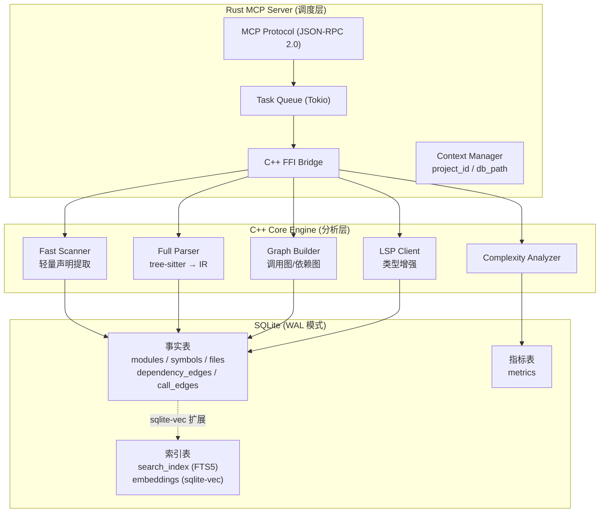
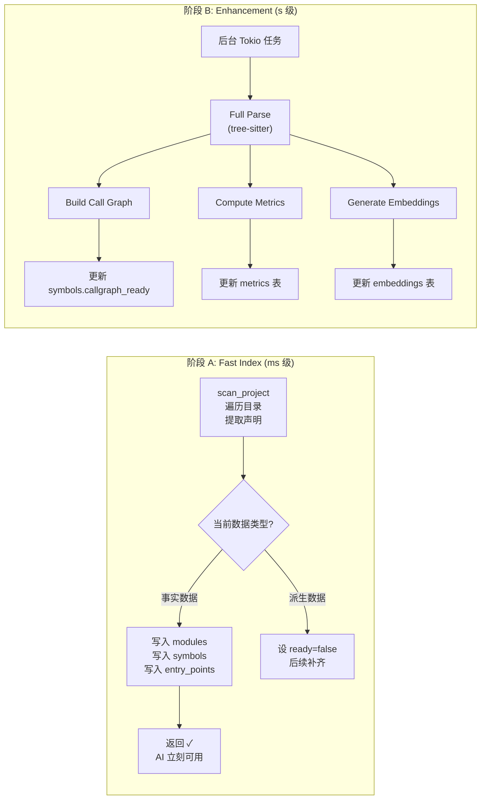

# CodeScope 架构调整

> 编码规范：[plan/rules/code_rules.md](plan/rules/code_rules.md)
>
> 核心原则：**数据库存事实（Facts），分析结果按需计算（Derived Data）**
>
> 参考：improve.md

---

## 一、架构图

### 整体架构



### 数据流



---

## 二、开发计划

### Phase A — Fast Index（预计 1-2 天）

**目标：** AI 发起 `scan_project` 后 ms 级返回模块树和符号速查

| 步骤 | 任务 | 产出 |
|------|------|------|
| A1 | 设计新 Schema（9 张表） | `task.md` + `store.cpp` |
| A2 | 建 `modules` / `symbols` / `entry_points` 表 | schema 生效 |
| A3 | 实现 `storeInsertModule` / `storeInsertSymbol` | 写入接口 |
| A4 | 实现 `engine_scan_project` | 快速扫描 |
| A5 | 实现 `get_module_tree` / `find_symbol` 查询 | 查询接口 |
| A6 | Rust: scan_project FFI + MCP Tool | AI 可用 |

**验收标准：**
```
scan_project("/project/foo")
→ 5ms 返回
→ {"modules": [...], "entry_points": [...], "total_symbols": 847}
```

### Phase B — Background Enhancement（预计 2-3 天）

**目标：** 扫描完成后，后台逐步补齐调用图、指标、语义搜索

| 步骤 | 任务 | 产出 |
|------|------|------|
| B1 | 建 `call_edges` / `dependency_edges` / `metrics` 表 | schema |
| B2 | Rust Tokio 后台任务调度 | 异步架构 |
| B3 | 增强任务：调用图生成 → 写 call_edges | 调用图就绪 |
| B4 | 增强任务：复杂度 + 指标 → 写 metrics | 指标就绪 |
| B5 | 增强任务：sqlite-vec embedding → 写 embeddings | 语义搜索就绪 |
| B6 | 更新 `symbols.xxx_ready` 标志 | 自适应查询 |

**验收标准：**
```
scan_project (返回后 5s)
→ callgraph_ready = true
→ call_edges 表有数据
→ search("parser") 走语义搜索 vs FTS 自适应
```

### Phase C — MCP Tools 统一（预计 1 天）

**目标：** 稳定 MCP 工具接口，后端自适应

| 步骤 | 任务 | 产出 |
|------|------|------|
| C1 | `find_symbol`（统一替代 find_definition） | 新 Tool |
| C2 | `search`（FTS / 语义自适应） | 新 Tool |
| C3 | `find_callers` / `find_callees`（自适应 ready 状态） | 新 Tool |
| C4 | `get_entry_points` / `get_module_tree` | 新 Tool |
| C5 | 旧 Tool 标记 deprecated（保留兼容） | 文档 |

### Phase D — 旧表清理（后续版本）

| 步骤 | 任务 | 产出 |
|------|------|------|
| D1 | 数据迁移脚本 | 旧 → 新 |
| D2 | v0.3.0 删除旧表 | 清理 |

---

## 三、数据库 Schema

### modules

```sql
CREATE TABLE modules (
    id INTEGER PRIMARY KEY AUTOINCREMENT,
    project_id INTEGER NOT NULL,
    parent_id INTEGER REFERENCES modules(id),
    name TEXT NOT NULL,
    path TEXT NOT NULL,
    language TEXT,
    file_count INTEGER DEFAULT 0,
    FOREIGN KEY (project_id) REFERENCES projects(id)
);
```

### symbols

```sql
CREATE TABLE symbols (
    id INTEGER PRIMARY KEY AUTOINCREMENT,
    project_id INTEGER NOT NULL,
    module_id INTEGER REFERENCES modules(id),
    kind TEXT NOT NULL,  -- function/method/class/struct/trait/enum/const/type_alias
    name TEXT NOT NULL,
    signature TEXT,
    visibility TEXT DEFAULT 'default',
    language TEXT NOT NULL,
    file_path TEXT NOT NULL,
    line INTEGER NOT NULL,
    column INTEGER NOT NULL,
    span_start INTEGER,  -- byte offset
    span_end INTEGER,
    callgraph_ready INTEGER DEFAULT 0,
    cfg_ready INTEGER DEFAULT 0,
    embedding_ready INTEGER DEFAULT 0,
    FOREIGN KEY (project_id) REFERENCES projects(id)
);
CREATE INDEX idx_symbols_name ON symbols(project_id, name);
CREATE INDEX idx_symbols_module ON symbols(module_id);
```

### entry_points

```sql
CREATE TABLE entry_points (
    symbol_id INTEGER PRIMARY KEY,
    project_id INTEGER NOT NULL,
    kind TEXT NOT NULL,  -- main/init/setup/run/handler
    FOREIGN KEY (symbol_id) REFERENCES symbols(id),
    FOREIGN KEY (project_id) REFERENCES projects(id)
);
```

### dependency_edges

```sql
CREATE TABLE dependency_edges (
    id INTEGER PRIMARY KEY AUTOINCREMENT,
    project_id INTEGER NOT NULL,
    source_symbol_id INTEGER NOT NULL,
    target_symbol_id INTEGER NOT NULL,
    kind TEXT NOT NULL,  -- import/include/inherit/implement/use/ffi
    FOREIGN KEY (source_symbol_id) REFERENCES symbols(id),
    FOREIGN KEY (target_symbol_id) REFERENCES symbols(id)
);
```

### call_edges

```sql
CREATE TABLE call_edges (
    id INTEGER PRIMARY KEY AUTOINCREMENT,
    project_id INTEGER NOT NULL,
    caller_symbol_id INTEGER NOT NULL,
    callee_symbol_id INTEGER NOT NULL,
    provenance TEXT DEFAULT 'static',  -- static/lsp/resolved
    line INTEGER,
    col INTEGER,
    FOREIGN KEY (caller_symbol_id) REFERENCES symbols(id),
    FOREIGN KEY (callee_symbol_id) REFERENCES symbols(id)
);
```

### metrics

```sql
CREATE TABLE metrics (
    symbol_id INTEGER PRIMARY KEY,
    cyclomatic INTEGER DEFAULT 0,
    nesting_depth INTEGER DEFAULT 0,
    cognitive INTEGER DEFAULT 0,
    lines INTEGER DEFAULT 0,
    param_count INTEGER DEFAULT 0,
    call_count INTEGER DEFAULT 0,
    branch_count INTEGER DEFAULT 0,
    loop_count INTEGER DEFAULT 0,
    FOREIGN KEY (symbol_id) REFERENCES symbols(id)
);
```

### search_index (FTS5)

```sql
CREATE VIRTUAL TABLE search_index USING fts5(
    name, signature, content,
    project_id UNINDEXED,
    symbol_id UNINDEXED,
    tokenize='unicode61'
);
```

### embeddings (sqlite-vec)

```sql
CREATE VIRTUAL TABLE embeddings USING vec0(
    symbol_id INTEGER PRIMARY KEY,
    vector FLOAT[384]  -- 384 维向量，用 all-MiniLM-L6-v2 模型
);
```

---

## 四、数据区分

| 表 | 数据类型 | 写入时机 | 查询速度 |
|------|---------|---------|---------|
| `modules` | 事实 | 扫描阶段 | O(1) |
| `symbols` | 事实 | 扫描阶段 | O(1) |
| `entry_points` | 事实 | 扫描阶段 | O(1) |
| `dependency_edges` | 事实 | 扫描阶段 | O(1) |
| `call_edges` | 事实 | 增强阶段 | O(1) |
| `metrics` | 派生 | 增强阶段 | O(1) |
| `search_index` | 索引 | 增强阶段 | O(log n) |
| `embeddings` | 索引 | 增强阶段 | O(log n) |

---

## 五、Task List（当前阶段）

### Phase A 当前任务

```
[ ] A1 建 modules / symbols / entry_points 表
[ ] A2 storeInsertModule / storeInsertSymbol
[ ] A3 engine_scan_project（快速扫描）
[ ] A4 engine_get_module_tree / find_symbol
[ ] A5 Rust FFI: scan_project / get_module_tree
[ ] A6 MCP Tool: scan_project / find_symbol
[ ] A7 验收: ms 级返回
```

---

## 六、变更记录

| 日期 | 版本 | 变更 |
|------|------|------|
| 2026-07-03 | v0.2.0 | 架构调整：9 表 Schema、Fast + Enhancement 两阶段 |
